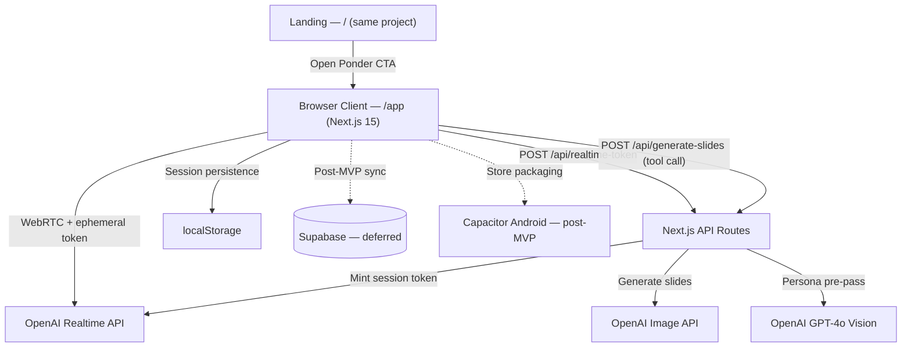

# System Design Document (SDD)

**Project:** Ponder — Living Portraits that teach through voice and visual story
**Date:** 2026-07-18
**Version:** 0.1
**Owner:** earlc [TBD — confirm]
**PRD:** [prd-curioframe.md](prd-curioframe.md)

---

## 1. Architectural Vision & Principles

**Architecture style:** Browser-first Next.js 15 (App Router) single project — `/` is the marketing landing page, `/app` is the mobile app experience rendered inside a mobile-ratio shell. OpenAI Realtime runs over WebRTC directly from the browser; Next.js API routes (same repo) mint ephemeral Realtime tokens and orchestrate slide generation, keeping API keys server-side. Sessions persist in browser `localStorage` for the MVP. **Capacitor** wraps the built web app for iOS/Android store distribution post-MVP — no separate native codebase.

**Guiding principles:**

- **Portrait-first UX:** Audio and slide pipelines are async; never block the portrait render path.
- **Cloud AI, protected keys:** OpenAI keys live only in Next.js API route env (Vercel); client receives short-lived Realtime session tokens.
- **Session as document:** Each capture creates one session with transcript, slide deck, and persona config — easy to save, replay, share.
- **Graceful degradation:** Realtime drop → text mode; slide gen fail → caption cards.

**Key trade-offs made:**

- **Browser-first over Expo React Native** — 3-hour build timebox; zero native toolchain; instant shareable URL; Capacitor wraps the same web build for stores later.
- Snapshot capture over live AR — ships faster, lower battery/thermal cost; AR deferred to v2.
- Push-to-talk default over always-listening — privacy + museum etiquette + lower accidental triggers.
- Server-mediated slide generation — quality and cost control vs client-side key exposure.
- localStorage over cloud persistence — no auth/signup friction in MVP; Supabase sync is the documented post-MVP path.

---

## 2. High-Level Architecture



**Layers:**

| Layer | Technology | Responsibility |
|-------|-----------|----------------|
| Web Client | Next.js 15 App Router + React 19 | `/` landing, `/app` mobile-shell UI, camera via `getUserMedia`, audio I/O, portrait animation, Realtime WebRTC client |
| Local Persistence | `localStorage` (JSON) | Session list, transcripts, slide URLs; IndexedDB if assets grow |
| API Routes | Next.js route handlers (same repo) | Realtime token mint, persona analysis, slide-gen tool handler |
| AI Realtime | OpenAI gpt-4o-realtime-preview (WebRTC) | Vision + voice in-character agent |
| AI Images | gpt-image-1 / DALL·E 3 | Educational slide illustrations |
| Infrastructure | Vercel | Hosting, preview deploys, API route env secrets |
| Native Packaging *(post-MVP)* | Capacitor — Android only | Wrap web build for Google Play; iOS stays web (Safari) |
| Cloud Sync *(post-MVP)* | Supabase (Postgres, Auth, Storage) | Cross-device sessions, accounts, RLS |

---

## 3. Data Architecture

**Primary store (MVP):** Browser `localStorage` — *reason: zero setup, no auth friction, 3-hour build*
**Cloud database (post-MVP):** Supabase Postgres — *reason: auth + RLS + storage integration when cross-device sync ships*
**Vector store:** N/A in V1 (persona context from session transcript only)

**MVP localStorage shape:**

```typescript
// key: "ponder.sessions" — JSON array, newest first
interface StoredSession {
  id: string;                    // crypto.randomUUID()
  title: string;                 // e.g. "Mona Lisa"
  photoDataUrl: string;          // downscaled capture (≤1024px JPEG data URL)
  persona: PersonaConfig;        // voice, systemPrompt, styleHint (RFC §3)
  transcript: TranscriptTurn[];  // { role, text, at }
  decks: SlideDeck[];            // slide image URLs + captions
  createdAt: string;             // ISO 8601
}

// key: "ponder.usage" — { date: "YYYY-MM-DD", count: number } for 3/day soft limit
// key: "ponder.prefs" — onboarding answers { preferSlides, useContext }
```

**Post-MVP cloud schema (Supabase Postgres — unchanged design, activated with sync):**

```
users
  id:              UUID (auth.users FK)
  created_at:      TIMESTAMPTZ
  display_name:    TEXT
  tier:            TEXT CHECK (tier IN ('free', 'pro')) DEFAULT 'free'
  daily_sessions:  INTEGER DEFAULT 0
  sessions_reset:  DATE

portrait_sessions
  id:              UUID PRIMARY KEY
  user_id:         UUID REFERENCES users(id)
  title:           TEXT                    -- e.g. "Mona Lisa"
  photo_url:       TEXT
  photo_thumb_url: TEXT
  persona:         JSONB                   -- voice, tone, system_prompt_hash
  status:          TEXT CHECK (status IN ('active','saved','archived'))
  created_at:      TIMESTAMPTZ DEFAULT now()
  updated_at:      TIMESTAMPTZ DEFAULT now()

messages
  id:              UUID PRIMARY KEY
  session_id:      UUID REFERENCES portrait_sessions(id)
  role:            TEXT CHECK (role IN ('user','assistant','system'))
  content_text:    TEXT
  audio_url:       TEXT NULL
  created_at:      TIMESTAMPTZ DEFAULT now()

slide_decks
  id:              UUID PRIMARY KEY
  session_id:      UUID REFERENCES portrait_sessions(id)
  message_id:      UUID REFERENCES messages(id) NULL  -- trigger turn
  topic:           TEXT
  created_at:      TIMESTAMPTZ DEFAULT now()

slides
  id:              UUID PRIMARY KEY
  deck_id:         UUID REFERENCES slide_decks(id)
  order_index:     INTEGER
  image_url:       TEXT
  caption:         TEXT
  prompt:          TEXT                    -- redacted in client logs
  created_at:      TIMESTAMPTZ DEFAULT now()
```

**Key relationships:**

- User has many portrait_sessions (1:N)
- Session has many messages (1:N)
- Session has many slide_decks (1:N)
- Deck has many slides (1:N)

**Caching strategy (MVP):**

- Active session kept in React state; flushed to `localStorage` on turn complete and session end
- Photos downscaled to ≤1024px and stored as data URLs inside the session record
- Slide images referenced by OpenAI-hosted URL while live; persisted as data URL on save (URLs expire)
- `localStorage` budget ~5MB → cap saved sessions at 5 (free-tier limit doubles as storage cap); oldest evicted with user confirmation
- Post-MVP: background sync to Supabase, photos in Storage bucket `portraits/{user_id}/{session_id}.jpg`, signed CDN URLs

---

## 4. API Design & External Integrations

**API style:** Next.js route handlers in the same repo (`app/api/*/route.ts`). Client uses plain `fetch`. Session CRUD is client-side `localStorage` — no server endpoints needed in MVP.

**Internal endpoints (MVP):**

| Method | Path | Purpose |
|--------|------|---------|
| `POST` | `/api/realtime-token` | Mint ephemeral OpenAI Realtime session (WebRTC SDP token) |
| `POST` | `/api/analyze-portrait` | Vision pre-pass: subject label + persona draft |
| `POST` | `/api/generate-slides` | Tool handler: topic → N images + captions |

**Deferred (post-MVP, Supabase sync):** `GET/POST/PATCH /rest/v1/portrait_sessions`, `POST /rest/v1/messages`, `POST /storage/v1/object/portraits/...`

**External integrations:**

| Service | Purpose | Rate Limits / Fallback |
|---------|---------|------------------------|
| OpenAI Realtime (WebRTC) | Voice + vision conversation | On disconnect → text GPT-4o mini chat via API route |
| OpenAI Images | Slide generation | On fail → text card + stock icon |
| Vercel | Hosting + API route secrets | Static demo assets bundled for offline pitch |
| Supabase *(post-MVP)* | Auth, DB, storage sync | Queue writes locally on error |
| Stripe / RevenueCat *(post-MVP)* | Pro subscription (web / native) | If down → honor cached entitlement 24h |

---

## 5. Security & Authorization

**Authentication (MVP):** None — anonymous browser sessions; a random device ID in `localStorage` scopes usage limits. Post-MVP: email magic link + Apple/Google OAuth via Supabase Auth.
**Session management (MVP):** No server session; ephemeral Realtime tokens are single-use, 60s expiry.
**Authorization model:** MVP has no server-stored user data. Post-MVP: RLS on all tables — `auth.uid() = user_id`.

**Data protection:**

- OpenAI keys only in Vercel env vars, read exclusively by API routes — never shipped to the browser
- Daily limit (3 sessions/day free) enforced at `/api/realtime-token` via device-ID cookie (soft limit; hardened with auth post-MVP)
- Photos stay in the browser (`localStorage`); sent to OpenAI only during an active session with consent disclaimer
- Camera/mic: browser `getUserMedia` permission prompts; mic stream released when push-to-talk ends
- User can wipe all data instantly — "Clear my sessions" deletes `localStorage` keys
- Child mode: no account exists in MVP; parental gate for save [TBD — confirm]

---

## 6. Infrastructure, CI/CD & Deployment

**Hosting:** Vercel — one Next.js project serves `/` (landing), `/app` (product), and `/api/*` (key-holding routes)

**Environments:**

- `dev`: `npm run dev` locally; `.env.local` holds `OPENAI_API_KEY`; mock Realtime optional
- `staging`: Vercel preview deployment per PR (shareable URL doubles as device-test build)
- `prod`: Vercel production on `main`

**CI/CD:** GitHub Actions — lint, typecheck, Vitest; Vercel auto-deploys on push

**Native packaging (post-MVP):** Capacitor project wrapping the web build (`next build` static output or remote `server.url`) → Android Studio → Google Play. **Android only** — iOS users use the web app in Safari (no Apple developer account / Mac toolchain needed).

---

## 7. Non-Functional Requirements

| Requirement | Target | Notes |
|-------------|--------|-------|
| Voice response latency | <2s after user end-of-speech | LTE, Realtime WebRTC connected |
| First awaken time | <5s | Persona pre-pass + WebRTC connect |
| Slide generation | <10s per slide | Parallel gen for deck of 3 |
| First page load (`/app`) | <3s | Next.js static + code-split engine |
| Uptime (backend) | 99.5% | Offline: show `localStorage` sessions |
| Max concurrent users V1 | 1,000 | Vercel serverless autoscale [TBD — confirm] |
| Data retention | Sessions until user deletes | GDPR export/delete path V1.1 |

---

## 8. AI / Agent Architecture

**AI approach:** Hybrid — Realtime multimodal agent over browser WebRTC (ephemeral token from `/api/realtime-token`); slide generation via `/api/generate-slides` tool calls triggered by agent function definitions.

**Model selection:**

| Task | Model / SDK | Reason |
|------|-------------|--------|
| Voice + vision chat | gpt-4o-realtime-preview | Low latency duplex audio |
| Subject analysis | gpt-4o (vision) | Pre-session persona setup |
| Slide images | gpt-image-1 | Consistent illustration style |
| Fallback text | gpt-4o-mini | Cost + reliability |

**Context architecture:**

- System prompt: persona + educational tone + slide tool instructions
- Session window: last 10 turns + subject metadata + slide topics already shown
- Vision: initial photo as base64 once; optional re-send on "what do you see" questions

**Tool surface:**

- `generate_slides({ topic, count, style_hint })` → `/api/generate-slides` → returns deck_id
- `update_session_title({ title })` → optional auto-title

**HITL gates:**

- User push-to-talk for each question
- User tap regenerate on slide deck
- Daily session limit enforced server-side before token mint

**Token / cost budget:**

| Operation | Est. cost | Monthly budget assumption |
|-----------|-------------|---------------------------|
| 5-min Realtime session | $0.20–0.35 | 1k free users × 3 sessions = ~$900/mo [TBD — confirm] |
| 3 slides | $0.12 | Bundled in session |
| Pro unlimited | LTV must cover ~$4/mo API at 20 sessions | See GTM pricing |

**Fallback behavior:** Text chat + bullet summary cards; bundled demo session assets in app binary for hackathon judges offline.

---

## Self-Check

- [ ] Section 2 has a Mermaid architecture diagram
- [ ] Section 3 defines all core entities with field types
- [ ] Every external integration in Section 4 has a fallback strategy
- [ ] Section 7 latency targets are specific numbers
- [ ] Section 8 is filled or marked N/A
- [ ] Known V1 shortcuts documented as tech debt in Section 1
- [ ] This document answers *how* to build, not *what* (that's the PRD's job)

---

*Next document: [RFC — living portrait engine](rfc-curioframe-living-portrait-engine.md)*
