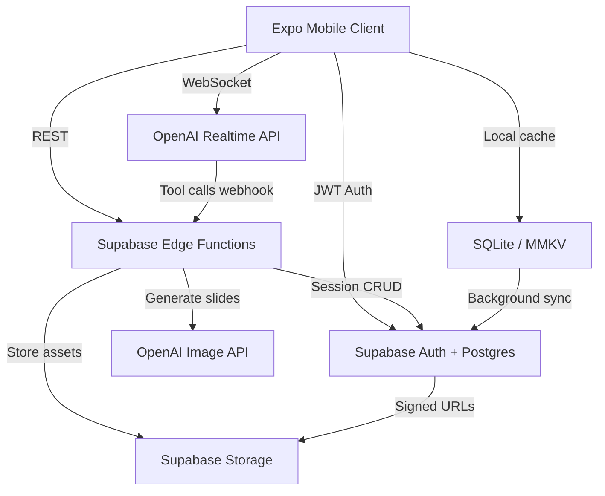

# System Design Document (SDD)

**Project:** Ponder — Living Portraits that teach through voice and visual story
**Date:** 2026-07-18
**Version:** 0.1
**Owner:** earlc [TBD — confirm]
**PRD:** [prd-Ponder.md](prd-Ponder.md)

---

## 1. Architectural Vision & Principles

**Architecture style:** Expo React Native mobile client + Supabase BaaS + OpenAI Realtime/WebSocket for voice-vision agent + server-side Edge Functions for slide generation orchestration and asset storage. The client owns capture, audio I/O, and portrait rendering; the cloud owns session persistence, image CDN URLs, and API key protection.

**Guiding principles:**

- **Portrait-first UX:** Audio and slide pipelines are async; never block the portrait render path.
- **Cloud AI, protected keys:** OpenAI keys live only in Supabase Edge Functions; client receives short-lived Realtime session tokens.
- **Session as document:** Each capture creates one session with transcript, slide deck, and persona config — easy to save, replay, share.
- **Graceful degradation:** Realtime drop → text mode; slide gen fail → caption cards.

**Key trade-offs made:**

- Snapshot capture over live AR — ships faster, lower battery/thermal cost; AR deferred to v2.
- Push-to-talk default over always-listening — privacy + museum etiquette + lower accidental triggers.
- Server-mediated slide generation — quality and cost control vs on-device nothing.

---

## 2. High-Level Architecture



**Layers:**

| Layer | Technology | Responsibility |
|-------|-----------|----------------|
| Client | Expo SDK 52 + React Native | Camera, UI, audio I/O, portrait animation, Realtime WS client |
| Local Cache | expo-sqlite + MMKV | Offline session list, pending sync queue |
| BaaS | Supabase (Postgres, Auth, Storage) | Users, sessions, slides metadata, RLS |
| Edge Functions | Deno on Supabase | Realtime token mint, slide-gen tool handler, share clip stub |
| AI Realtime | OpenAI gpt-4o-realtime-preview | Vision + voice in-character agent |
| AI Images | gpt-image-1 / DALL·E 3 | Educational slide illustrations |
| Infrastructure | EAS Build + Supabase Cloud | CI builds, hosting |

---

## 3. Data Architecture

**Primary database:** Supabase Postgres — *reason: auth + RLS + storage integration, fast hackathon setup*
**Secondary / cache:** SQLite on device — *reason: session list offline*
**Vector store:** N/A in V1 (persona context from session transcript only)

**Core entities:**

```
users
  id:              UUID (auth.users FK)
  created_at:      TIMESTAMPTZ
  display_name:    TEXT
  tier:            TEXT CHECK (tier IN ('free', 'pro')) DEFAULT 'free'
  daily_sessions:  INTEGER DEFAULT 0
  sessions_reset:  DATE

portrait_sessions
  id:              UUID PRIMARY KEY
  user_id:         UUID REFERENCES users(id)
  title:           TEXT                    -- e.g. "Mona Lisa"
  photo_url:       TEXT
  photo_thumb_url: TEXT
  persona:         JSONB                   -- voice, tone, system_prompt_hash
  status:          TEXT CHECK (status IN ('active','saved','archived'))
  created_at:      TIMESTAMPTZ DEFAULT now()
  updated_at:      TIMESTAMPTZ DEFAULT now()

messages
  id:              UUID PRIMARY KEY
  session_id:      UUID REFERENCES portrait_sessions(id)
  role:            TEXT CHECK (role IN ('user','assistant','system'))
  content_text:    TEXT
  audio_url:       TEXT NULL
  created_at:      TIMESTAMPTZ DEFAULT now()

slide_decks
  id:              UUID PRIMARY KEY
  session_id:      UUID REFERENCES portrait_sessions(id)
  message_id:      UUID REFERENCES messages(id) NULL  -- trigger turn
  topic:           TEXT
  created_at:      TIMESTAMPTZ DEFAULT now()

slides
  id:              UUID PRIMARY KEY
  deck_id:         UUID REFERENCES slide_decks(id)
  order_index:     INTEGER
  image_url:       TEXT
  caption:         TEXT
  prompt:          TEXT                    -- redacted in client logs
  created_at:      TIMESTAMPTZ DEFAULT now()
```

**Key relationships:**

- User has many portrait_sessions (1:N)
- Session has many messages (1:N)
- Session has many slide_decks (1:N)
- Deck has many slides (1:N)

**Caching strategy:**

- Active session kept in memory + SQLite mirror
- Completed sessions sync to Supabase; photos in Storage bucket `portraits/{user_id}/{session_id}.jpg`
- Slide images immutable once written; CDN via signed URLs (1h) or public bucket with RLS path

---

## 4. API Design & External Integrations

**API style:** Supabase PostgREST + Edge Functions. Client uses `@supabase/supabase-js`.

**Internal endpoints (high-level):**

| Method | Path | Purpose |
|--------|------|---------|
| `POST` | `/functions/v1/realtime-token` | Mint ephemeral OpenAI Realtime session |
| `POST` | `/functions/v1/analyze-portrait` | Vision pre-pass: subject label + persona draft |
| `POST` | `/functions/v1/generate-slides` | Tool handler: topic → N images + captions |
| `GET` | `/rest/v1/portrait_sessions?user_id=eq.{id}` | List sessions |
| `POST` | `/rest/v1/portrait_sessions` | Create session |
| `PATCH` | `/rest/v1/portrait_sessions?id=eq.{id}` | Update title/status |
| `POST` | `/rest/v1/messages` | Persist turn |
| `POST` | `/storage/v1/object/portraits/...` | Upload capture |

**External integrations:**

| Service | Purpose | Rate Limits / Fallback |
|---------|---------|------------------------|
| OpenAI Realtime | Voice + vision conversation | On disconnect → text GPT-4o mini chat |
| OpenAI Images | Slide generation | On fail → text card + stock icon |
| Supabase | Auth, DB, storage | Queue writes locally on error |
| RevenueCat | Pro subscription | If down → honor cached entitlement 24h |
| Expo Notifications | Session ready / daily limit reset | Optional V1.1 |

---

## 5. Security & Authorization

**Authentication:** Email magic link + Apple/Google OAuth via Supabase Auth. Anonymous mode for demo only [TBD — confirm].
**Session management:** Supabase JWT in SecureStore; refresh automatic.
**Authorization model:** RLS on all tables — `auth.uid() = user_id`.

**Data protection:**

- PII encrypted at rest via Supabase
- OpenAI keys only in Edge Function secrets
- Photos: user-scoped storage paths; delete cascades on account delete
- Camera/mic: processed on device for capture; photo sent to OpenAI only during active session with consent disclaimer
- Child mode: no account required for demo; parental gate for save [TBD — confirm]

---

## 6. Infrastructure, CI/CD & Deployment

**Hosting:** EAS for iOS/Android builds; Supabase cloud; Vercel for marketing site

**Environments:**

- `dev`: Local Supabase + Expo dev client; mock Realtime optional
- `staging`: Supabase staging project; TestFlight / Internal track
- `prod`: Production Supabase; App Store / Play Store

**CI/CD:** GitHub Actions — lint, typecheck, Jest; EAS build on `main` tag

---

## 7. Non-Functional Requirements

| Requirement | Target | Notes |
|-------------|--------|-------|
| Voice response latency | <2s after user end-of-speech | LTE, Realtime connected |
| First awaken time | <5s | Photo upload + Realtime connect |
| Slide generation | <10s per slide | Parallel gen for deck of 3 |
| Cold start | <3s | Expo optimized bundle |
| Uptime (backend) | 99.5% | Offline: show cached sessions |
| Max concurrent users V1 | 1,000 | Edge Function autoscale [TBD — confirm] |
| Data retention | Sessions until user deletes | GDPR export/delete path V1.1 |

---

## 8. AI / Agent Architecture

**AI approach:** Hybrid — Realtime multimodal agent on device WS; slide generation via Edge Function tool calls triggered by agent function definitions.

**Model selection:**

| Task | Model / SDK | Reason |
|------|-------------|--------|
| Voice + vision chat | gpt-4o-realtime-preview | Low latency duplex audio |
| Subject analysis | gpt-4o (vision) | Pre-session persona setup |
| Slide images | gpt-image-1 | Consistent illustration style |
| Fallback text | gpt-4o-mini | Cost + reliability |

**Context architecture:**

- System prompt: persona + educational tone + slide tool instructions
- Session window: last 10 turns + subject metadata + slide topics already shown
- Vision: initial photo as base64 once; optional re-send on "what do you see" questions

**Tool surface:**

- `generate_slides({ topic, count, style_hint })` → Edge Function → returns deck_id
- `update_session_title({ title })` → optional auto-title

**HITL gates:**

- User push-to-talk for each question
- User tap regenerate on slide deck
- Daily session limit enforced server-side before token mint

**Token / cost budget:**

| Operation | Est. cost | Monthly budget assumption |
|-----------|-------------|---------------------------|
| 5-min Realtime session | $0.20–0.35 | 1k free users × 3 sessions = ~$900/mo [TBD — confirm] |
| 3 slides | $0.12 | Bundled in session |
| Pro unlimited | LTV must cover ~$4/mo API at 20 sessions | See GTM pricing |

**Fallback behavior:** Text chat + bullet summary cards; bundled demo session assets in app binary for hackathon judges offline.

---

## Self-Check

- [ ] Section 2 has a Mermaid architecture diagram
- [ ] Section 3 defines all core entities with field types
- [ ] Every external integration in Section 4 has a fallback strategy
- [ ] Section 7 latency targets are specific numbers
- [ ] Section 8 is filled or marked N/A
- [ ] Known V1 shortcuts documented as tech debt in Section 1
- [ ] This document answers *how* to build, not *what* (that's the PRD's job)

---

*Next document: [RFC — living portrait engine](rfc-Ponder-living-portrait-engine.md)*
